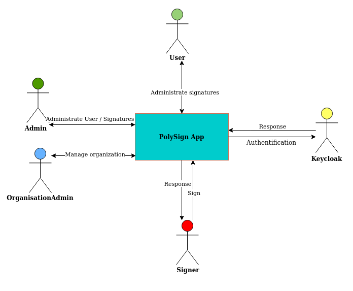
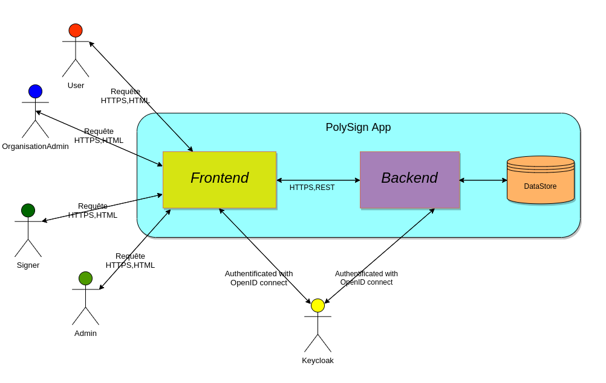
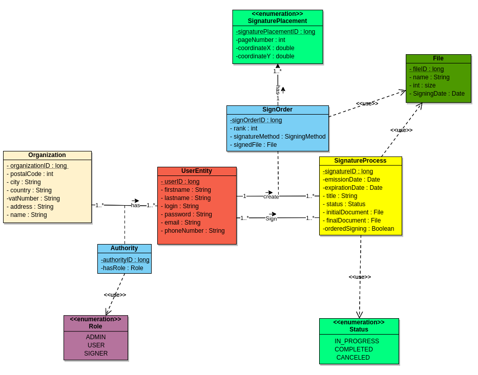
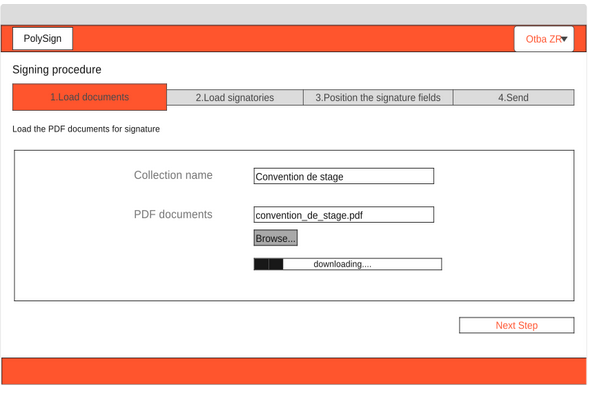
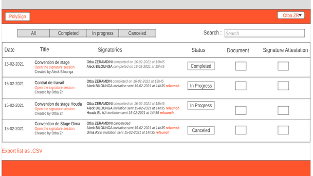
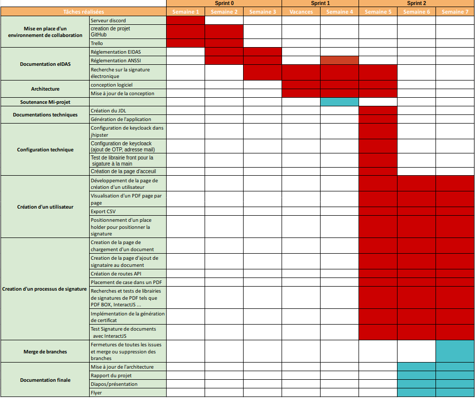
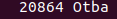
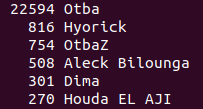

#### UNIVERSITÉ DE GRENOBLE ALPES- GRENOBLE INP

**École polytechnique de l'université Grenoble-Alpes**


```
Rapport de projet eIDAS
```
## Projet de Signature électronique eIDAS*

```
Projet de fin d’étude de cycle d’ingénieur en informatique
```
```
Étudiants:
ASSI Dima
BILOUNGA Aleck
EL AJI Houda
ZERAMDINI Otba
```
```
Porteur de projet:
Prof. PALIX Nicolas
```

- Projet de Signature électronique eIDAS*
- Remerciement
- Objectif du projet
- Technologies Utilisées
- Architecture
- Maquettes
- Gestion de projet :
- Outils
   - 6.1 Outils de collaboration :
   - 6.2 Outils de développement :
- 7. Métriques Logicielles
   - Coût du Projet
- 8. Réalisations techniques
   - Front-end:
   - Back-end:
- 9. Difficultés et contraintes
- 10. Améliorations
- 11. Conclusion
- Bibliographie


## Remerciement

Nous tenons à remercier chaleureusement Monsieur Nicolas Palix notre porteur de projet
qui nous a donné l’opportunité de pouvoir réaliser ce projet. Sans sa disponibilité et son aide
très précieuse, ce projet n’aurait pas vu le jour. Nous tenons à exprimer, également notre
profonde reconnaissance pour toutes l’équipe pédagogique de Polytech Grenoble, qui nous
a fourni les outils pour réussir ce projet.

## Objectif du projet

L’objectif de notre projet est de créer un serviceauto-hébergeable PolySign qui va
permettre de signer des documents administratifs au sein de l’université,
principalement les conventions de stage entre administration,étudiants et
entreprises.

Le but principal est de faire la conception et l'implémentationd’un service eIDAS
auto-hébergeable et open-source du workflow de documents par des acteurs
identifiés au moyen de plusieurs systèmes d’authentification(Oauth2). En d’autres
termes, ce service de signature électronique doit respecter les réglementation
Françaises et Européennes de la signature électronique.

Le fait d’avoir ce genre d’outils à l’école permettra de signer ces documents en toute
sécurité et sans avoir recours à d’autres logiciels comme Yousign, docusign...

PolySign permet alors à ses utilisateurs de créer des processus de signature,
attribuer des signataires, visualiser des documents et les signer en toute sécurité en
se reposant sur un système de chiffrement à clé publique et clé privée pour signer et
vérifier la signature.

## Technologies Utilisées

Tout d’abord nous avons décidé d’utiliser un générateur de code : JHipster. En effet,
n’ayant que 2 semaines pour développer l'application,il était impossible de tout
développer de zéro. JHipster est un générateur d'application libre et open source
utilisé pour développer rapidement des applications Web modernes en utilisant
Angular et le framework Spring. JHipster propose unoutil en ligne nommé JDL
Studio particulièrement utile et simple d’utilisation. Cet outil permet grâce à un
diagramme UML de générer du code Java et Angular. D’autre part pour le Mapping
Objet Relationnel nous utilisons la technologie JPA au niveau de la couche DAO.


D’autre part, notre choix s’est porté sur le framework JavaScript angular puisqu’il
permet d’écrire son code de manière très structuré avec TypeScript qui est un
langage orienté objet. De plus, ce framework fournitla possibilité de créer des SPA
(single page application). D’autre part, son riche écosystème facilite la
documentation et l’obtention d’aide. Il est également à noter que son architecture
modulaire permet aux développeurs de développer en parallèle et de manière
indépendante. Autrement dit, il permet de rendre le développement front-end plus
rapide et plus simple.
D’autre part, nous utilisons BootStrap qui est une collection d'outils utiles à la
création du design de sites et d'applications web. Cette collection d’outils permet de
charger rapidement des templates dans un projet et offre là encore un gain de temps
considérable.

En Backend notre choix s’est porté sur le framework Java Spring. D’une part parce
que le langage Java est un langage maîtrisé par l’ensemble des membres du groupe
et d’autre part parce que le framework Spring est un des framework les plus utilisé,
ce qui permet encore une fois de trouver plus facilement de la documentation.
Nous avons ainsi choisi pour la partie DAO le framework Spring Data. Ce framework
est très utile car il permet de déduire les requêtes à partir des signatures des
méthodes. Il représente un gain de temps important.

De plus, nous avons utilisé la couche service SpringBoot qui est un conteneur léger.
Spring Boot permet de faciliter le code de la couche service notamment avec
l’instanciation automatique via constructeur ou via l’annotation @Autowired.
Pour la couche web service on utilise le framework Spring Rest Api qui permet
d’exposer une API REST et de communiquer avec le Front-End ou avec d’autres
systèmes.

Pour la partie authentification nous avons décidé d’utiliser le framework Keycloak.
Keycloak est un outil permettant de centraliser l’infrastructure de sécurité des
applications. Il permet à la fois la gestion des identités des authentifications et des
autorisations. Cet outil se base sur des standards des protocoles de sécurité tels
que OpenID Connect, OAuth2. Ainsi il permet de mettre en place la double
authentification comme OTP.


## Architecture

```
Dans notre application nous avons 4 acteurs qui interagissent avec l’application :
```



#### Diagramme de contexte


● Le User est l’utilisateur d’une organisation.
● L’ Admin est l’administrateur de l’application
● L’ OrganisationAdmin est l’administration d’une organisation
● Le Signer est le signataire
● Keycloack est le service d’authentification exte
Chaque acteur à une liste de fonctionnalités qui sont résumées dans le diagramme
des cas d’utilisations suivant :


#### Diagramme des cas d’utilisation

D’autre part, nous avons choisi une architecture Front-Endet Back-End de
l’application. Avec une architecture MVVM (modèle-vue-vue-modèle) en front-end et
une architecture à trois couches en back-end (WebService, Service en métier et
DAO (Data Access Object).




Nous avons également réalisé un diagramme de classe UML de l’application qui se
présente comme suit :



Ce diagramme de classe nous a permis de créer le JDL et de générer le code grâce
à JHipster, et ainsi d’obtenir une architecture globale de l’application. Ce diagramme
est constitué de 6 entités.
* L‘entité organisation correspond à l’organisation,par exemple polytech ou
l’UGA ou Grenoble INP.
* L’entité UserEntity correspond à un utilisateur quelconque.
* L’entité Authorit est une association qui réalise le lien entre un utilisateur et
une organisation. Elle permet de donner à chaque utilisateur un rôle dans
chacune de sa ou ses organisations.
* L’entité signatureProcess correspond au processus de signature. Ainsi, si une
signature doit être créée cette entité doit être instanciée.
* L’entité SignOrder est très importante, elle est une classe d’association qui
fait le lien entre un utilisateur et un processus de signature. Elle permet ainsi
à la fois de mettre un ordre de signature. Et d’associer un fichier à chaque
signataire.
* L’entité SignaturePlacement permet quant à elle de relever depuis le front-end
l’ensemble des localisations dans le pdf où une personne doit signer (numéro
de page, localisation de la signature en 2 dimensions).


## Maquettes



La maquette ci-dessus présente la première étape de la création d’un processus de
signature qui consiste à donner un nom au processus et charger le fichier à signer.
Cette étape fait partie de 4 étapes du processus: choisir les signataires, positionner
les signatures sur le pdf et finalement envoyer l’invitation.



Cette deuxième maquette présente la liste des processus en détail. Elle comporte la
date de la création de chaque processus, son nom,les signataires qui lui ont été
attribués, son statut(complet, en progrès ou annulé),le document à signer et
l’attestation de signature.
Elle comporte aussi le bouton qui permet de faire l’export csv de toute la liste.

## Gestion de projet :

Nous avons appliqué la méthode agile SCRUM pour la gestion de notre projet. Nous avons donc un chef de projet - Otba Zeramdini - et un SCRUM master - Aleck


BILOUNGA. Nous avons donc partager les rôles au sein de notre équipe comme le
suivant :

```
● Otba ZERAMDINI : Chef de projet & Développeur Back-end
● Houda ELAJI : Développeuse Front-end & DevOps
● Dima ASSI : Développeuse Back-end & gestionnaire de base de données
● Aleck BILOUNGA : Développeur Front-end & SCRUM Master
```
Afin d’ếtre en contact et en relation tout au longdu projet nous avons effectué des
daily meetings chaque jour. Ces daily meeting permettent d’être renseigné des
avancements de chacun et de discuter des choix techniques. Pour cela, nous avons
utilisé Trello pour partager nos tâches sous forme de ticket. D’autre part, Github
nous a permis de collaborer sur l’implémentation du code. En effet, pour chaque
tâche déjà définie, nous avons créé un **_issue associée._** Nous avons associé à
chaque issue une branche. De plus, une pull request assignée à un autre membre
pour revoir le code et le fusionner dans la branche **_dev_**.
Finalement, nous avons effectué un dernier **_merge_** de la branche **dev** vers la
branche **_master._**

Afin de progresser sur les tâches complexes, nous avons opté pour **_Live share
code_** pour programmer collectivement.

Pour une première étape du projet nous avons réalisé un planning prévisionnel :


Tout au long de notre projet, le planning prévisionnel a été changé et amélioré au
fur et à mesure de notre progression sur les différentes tâches prévues :




**Gith**

**6. Outils**

### 6.1 Outils de collaboration :

```
● Github : pour bien séparer le travail produit pour chaque fonctionnalité,
avoir un emplacement approprié pour héberger notre projet avec Git et
pouvoir intégrer le plus grand nombre possible de services externes.
En plus Github nous a permis d’organiser le travailen créant des issues pour
suivre les tâches, les partager et les discuter avec les membres de l’équipe.
Nous avons deux répertoires :
```
1. App : contenant l’implémentation de notre application web.
2. Docs : Contenant toute la documentation technique de notre projet.


```
● Trello : Pour garder un journal d’activité présentant nos accomplissements
sur l’ensemble du projet et organiser la répartition des tâches en le mettant à
jour par tous les membres de l’équipe.
● GitKraken : interface graphique intuitive de Git qui simplifie et rationalise
les processus Git.
● Discord : Pour assurer la communication au sein de l’équipe et avec notre
responsable, faire des points, discuter les tâches, partager des ressources et
travailler collectivement ou en binôme pour résoudre des problèmes ou
achever des tâches compliquées. Nous avons alors créé un serveur
comportant plusieurs salons textuels et vocaux.
● BBB ( BigBlueButton ) : Un deuxième outil de communication plus simple
utilisé pour communiquer essentiellement avec notre responsable de projet
pour discuter l’avancement du projet.
```
### 6.2 Outils de développement :

```
● Visual Studio Code : Éditeur pour le développement Front-end et
Back-end
● IntelliJ IDEA : Éditeur pour le développement Front-end et Back-end
● Docker : Outil d'empaquetage d'une application et de ces
dépendances
● JHipster : outils de génération de code.
```
## 7. Métriques Logicielles

Nous avons réalisé des métriques sur le nombre de commits ainsi que sur le nombre de lignes de code. Le nombre de commits est assez représentatif du travail mais pas complètement puisque la taille des commits varie par rapport à d'autres. De même, pour le nombre de lignes de code, on peut voir qu’Houda et Dima ont un faible nombre de lignes de code. Cela, n’est pas complètement représentatif du travail de  tous les membres car c’est surtout dû au fait qu’elles ont passé beaucoup de temps à tester les différentes librairies pour visualiser et d’ajouter un canvas dans un PDF côté front end ou encore de lire/écrire puis de signer dans un PDF côté back end. En
résumé

  lignes de code à l'intialisation de l'application
 lignes de code en fin de projet


```
● Nombre de commits : 115 commits au total
● Aleck Bilounga : 29%
● Dima Assi : 12%
● Houda El Aji : 18%
● Otba Zeramdini : 41%
● Lignes de code ajouté par nous: 
4377 lignes au total
● Aleck Bilounga : 30%
● Dima Assi : 7%
● Houda El Aji : 6%
● Otba Zeramdini : 57%
```

### Coût du Projet

Dans le but d’estimer le coût du projet, nous avons utilisé la formule du COCOMO.

Pour l'appliquer, nous devons déterminer la complexité de notre application. Notre
application est assez simple, mais elle requiert une mise en place de signature à
l’aide chaîne de certificats ssl qui est assez complexe à mettre en œuvre pour suivre
la réglementation eIDAS. Ainsi nous avons donc considéré notre application comme
organique.
Le projet compte 4377 lignes de code. Si nous appliquons le COCOMO ,on obtient
:
Effort = 2.4 * (4377/1000)^1.05 = 11.3 mois-homme

En sachant que le salaire d’un développeur junior en France est de 3000€brut/mois
on obtient donc pour notre projet un coût de 11.3*(3000€*1.45)= 49155€ en incluant
les charges patronales.

**Temps Ingénieur** : On a passé environ 290 h sur le projet si on compte aussi le temps en dehors des cours et la fin de semaine. Voici un résumé du temps qu’on a passé sur certaines tâches du projet. On a passé 5 semaines sur la documentation eIDAS, 3 semaines sur l’Architecture, 1 semaine sur la configuration Keycloak (Otba), 2 semaines sur la signature dans un PDF en Backend (Dima, Otba), 3 semaines sur la Visualisation de PDF, positionnement d’emplacement de signature (Houda ,(Aleck)), 3 semaines sur l’interface utilisateur (Aleck,(Houda)).


## 8. Réalisations techniques

### Front-end:

```
● Création d’un utilisateur: Nous avons développé la possibilité de créer un
utilisateur en lui attribuant un nom, un prénom, une adresse mail et un
numéro de téléphone.
● Assignation d’un rôle lors de la création: Quand un utilisateur est créé il peut
avoir le rôle d’un admin, user ou signer.
● Création d’un processus de signature et chargement de fichier: L’utilisateur de
PolySign peut créer un processus de signature en plusieurs étapes. D’abord il
choisit l’organisation à laquelle est attribué le processus, il choisit le fichier à
signer et il ajoute des signataires à ce processus en donnant leurs noms,
prénoms, adresse mail et numéro de téléphone.
● Affichage d’un pdf page par page: Après avoir chargé le pdf, l’utilisateur aura
la possibilité de le visualiser et de naviguer dans la fenêtre page par page.
● Drag and drop: Le but de cette étape était d’avoir la possibilité d’avoir chacun
des signataires dans un rectangle défini par son nom. Puis avoir la possibilité
de glisser et déposer chaque rectangle sur le pdf pour définir la position où la
```

```
signature sera visualisée. Nous avons pu implémenter le fait de bouger les
rectangles dans la fenêtre mais pas les déposer surle pdf à cause de
problèmes de récupération des coordonnées.
● Export CSV: Dans le front nous avons ajouté un bouton pour faire l’export csv
de la liste des utilisateurs et la liste de processus de signatures.
```
### Back-end:

❏ Authentification:
* Configuration Keycloack dans Jhipster :
Tout d’abord il s’agit de lier les la configuration de jhipster avec Keycloack afin que jhipster
nous redirige vers Keycloack pour l’authentification.
D’autre part pour pouvoir communiquer avec Keycloack, il faut partager un secret avec
Keycloack. En effet, la gestion des utilisateurs (création, suppression, changement de rôle
...) se fait grâce à l’échange de ce secret. Pour pouvoir par exemple créer un utilisateur
Keycloack il faut d’abord créer une classe java **UserKeycloak.java** qui permet de récupérer
les utilisateurs et leurs différents champs au niveau du back-end. Pour accéder à keycloack
nous créons une classe **KeycloakConfig.java** qui permet de récupérer un Objet Keycloack qui
va nous permettre de communiquer avec Keycloack. Dans la classe
**KeycloakAdminClientService.java nous** créons l’ensemble des services ou méthodes pour
créer un utilisateur modifier supprimer un utilisateur. Ces services sont directement accessibles
par le front-end via la couche web service et donc une API Rest.
❏ API et couche métier:
* Création d’un processus de signature :
Pour la création d’un processus de signature, nous créons des services de création d’un
processus de signature qui permettent de créer automatiquement les sign order associé aux
utilisateurs et ainsi leurs fichiers associés. Des routes API ont été créées pour par exemple
récupérer l’ensemble des organisations de la personne connectée, pour déterminer le rôle
de la personne connectée ...
* Création d’utilisateurs et création d’autorités associées:
La création d’utilisateur s’est faite également via un service de création d’utilisateur. Cette
création est assez délicate puisqu’elle implique la création de l’entité Authorit. De plus cette
création d’utilisateur implique l’envoi d’email vers l’utilisateur créer et la génération
automatique d’un password. De plus, il est à ajouter que cette création d’utilisateur sur
jhipster créer un utilisateur sur keycloak. C’est lors de cette phase que l’authentification
avec OTP est configurée.


* Création de certificat : Nous avons dans cette partie, avec java, généré pour
les signatures des pairs de clés privé et publiques. Cette partie est
essentiellement faite pour que les signatures soient bien vérifiées. La taille de
la clé publique est bien de 3072 bits.


* Signature d’un pdf : La signature des pdfs en back-end se fait en choisissant
l’id du fichier à signer et l’id du user qui va signer. À ce moment là les clés seront créés, et un nouveau fichier remplace l’ancien dans la base de données avec les coordonnées du signataires et les information du certificat
ajoutés sur le pdf à l’aide de la librairie Spire.pdf.
## 9. Difficultés et contraintes

Étant donné que nous travaillons sur un nouveau projet,le cadre du travail n’était
pas défini auparavant. En effet, nous avons passé un temps considérable sur la
partie de conception UML et la mise en œuvre de l'architecture globale du projet.

L’objectif de notre projet est la réalisation de signatures électroniques avec les
normes eIDAS. Cela implique l’utilisation des certificats et des chaînes de certificats.
De ce fait, nous avons, au début, eu des difficultés à comprendre toutes ces notions.
Ainsi, dans le cadre des réglementations eIDAS et ANSSI, nous avons été amenés
aussi à bien faire attention à toutes les exigences techniques, comme par exemple
l’algorithme d'encryption (SHA-256) et la taille des clés ( 3072 bytes ).

Par ailleurs, la recherche des librairies pour la signature d’un PDF était assez
délicate. Nous avons perdu beaucoup du temps et d'efforts à essayer des différentes
libraires en Angularjs/Javascript pour réaliser cette tâche. Cela englobe la signature
manuelle et le positionnement des emplacements des signatures sur le document,
sans oublier la visualisation du fichier nativement dans l’application. Cela peut
s’expliquer d’une part, du manque de maîtrise de ces différents frameworks. D’une
autre part par le manque d' exemples facilitant leurprise en main rapidement. En
addition, au cours de nos recherches nous avons constaté que même les plus
fameuses plateformes de signatures électroniques(ex. DocuSign), s'appuient sur
des fournisseurs des technologies de traitement de documents ( PDFTron ). Ces
systèmes de signatures sont souvent payants.

Nos ambitions au départ étaient de réussir à livrer une première version utilisable de
l’application. Mais le manque de temps a été un frein à la réalisation de cet objectif.
Finalement, ce projet a été très intéressant, nous aurions bien aimé pouvoir avoir
plus de temps pour le terminer, ou du moins livrer une première version de
l’application.

## 10. Améliorations


Vu les difficultés rencontrés au cours de notre travail sur ce projet nous estimons
que des éventuelles amélioration peuvent ếtre apporter à notre réalisation :

```
● Créer des signataires à partir des fichier CSV (ex. élèves de Polytech)
● Prise en compte des rôles pour la gestion des autorités.
● Affichage de la liste des utilisateurs lors de la phase de création de la
signature.
● Modification du PDF en Front-End (librairie drag anddrop).
● Liaison du Front-end et Back-end pour l’emplacement des différentes
signatures.
● Créer une interface de signataire (signer).
● Ajouter une barre de recherche pour récupérer les utilisateurs
● Amélioration de l’ UI/UX design.
```
## 11. Conclusion

Finalement, ce projet était très enrichissant. Nous avons aimé travailler sur l’aspect
sécurité. En effet, nous avons découvert différents aspects liés à ce domaine dans le
cadre du développement de l’application tel que Oauth2,OpenID connect et JWT...
De plus, ce projet étant d’actualité, en raison de la situation sanitaire, il permettra à
l’université d’avoir le privilège de posséder son propre service de signature
électronique. Ainsi ce service va fournir à l’université la possibilité de signer à
distance des conventions de stage pour ses étudiants.Ce projet nous a permis de
réaliser la conception complète d’un projet. De la documentation à la conception
puis à l’implémentation, ce projet nous a permis d’aborder tous les points de la
conception logicielle. Ce projet a donc été très instructif pour l’ensemble des
membres de l’équipe. Nous sommes déçus de ne pas avoir pu aller tout au bout du
projet et de livrer une première version de l’application. Mais les connaissances que
nous avons pu en tirer sont sans égales.


## Bibliographie

* EIDAS documentation
https://www.ssi.gouv.fr/entreprise/reglementation/confiance-numerique/le-reglement-eidas/documents-publies-par-lanssi/
https://www.certeurope.fr/blog/lhorodatage-des-documents-electroniques/
https://www.keylength.com/fr/5/
https://blog.signaturit.com/en/what-is-the-eidas-regulation-and-how-does-it-benefit-companies

* JHipster
https://www.jhipster.tech/
[http://www.jhipster-book.com/#!/](http://www.jhipster-book.com/#!/)
Full Stack Development with JHipster: Build modern web applications and microservices
with Spring and Angular (English Edition)
* Keycloak
https://www.keycloak.org/docs/6.0/server_admin/

* OAuth
https://oauth.net/2/

* OpenID Connect
https://openid.net/connect/
https://www.infoq.com/fr/articles/introduction-openid-connect/

* JWT (JSON Web Token)
https://blog.ippon.fr/2017/10/12/preuve-dauthentification-avec-jwt/


