                              
# Introduction

This document is the technical documentation of our eIDAS project, an electronic signature web application that we called ` "PolySign" `. It is divided into four parts:
* Documentation on electronic signature regulations: [eIDAS](https://www.ssi.gouv.fr/entreprise/reglementation/confiance-numerique/le-reglement-eidas/) in Europe and [ANSSI](https://www.ssi.gouv.fr/) in France;
* The technical documentation of the user : User account & signature process creation
* Used Technologies and libraries. 

# Regulations

## The eIDAS regulation 

The `eIDAS` (Electronic IDentification And Trust Services) regulation applies to electronic identification, trust services and electronic documents. It aims to establish an interoperability framework for the different systems put in place within the Member States in order to promote the development of a digital trust market.
The regulation sets out requirements for the mutual recognition of electronic means of identification as well as of electronic signatures, for exchanges between public sector bodies and users. It excludes internal exchanges between administrations without direct impact on third parties as well as private signing documents.

The eIDAS regulation replaced Directive 1999/93 / EC. We find in eIDAS the concept of the three types of signature - low, substantial (SEA), high, which was already found in the said directive. However, the eIDAS regulation has brought new updates on this subject. It specifies that qualified electronic signatures and qualified electronic seals are produced respectively by means of:
* Qualified electronic signature creation devices;
* Qualified electronic seal creation devices.

Thus, what characterizes eIDAS the most is that in this case it is:
  * A uniform text of law valid for all of Europe which is uniform to the different national laws applied by each member state of the European Union. This speeds up the use of electronic signatures in cross-border transactions. 
  * An advanced electronic signature based on the prior obtaining of an electronic signature certificate. Qualified electronic signature certificates within the meaning of regulation n ° 910/2014 “eIDAS” are issued by qualified electronic certification service providers.
  * The ability to create qualified signatures in the cloud instead of using hardware.
  * A legal value for the simple electronic signature too. 

## The ANSSI regulation 

In France, the role of supervisory body for trust services is performed by `ANSSI` (The French National Agency for the Security of Information Systems). As such, it supports in particular:
-The definition of the technical modalities allowing compliance with the requirements of the regulation
- ANSSI is involved in the application of regulations in two ways: as a security guarantor for the "electronic identification" component and as a supervisory body for the "trust service" component.

ANSSI develops and maintains trust lists listing qualified trust service providers and the qualified trust services they provide;
In France, ANSSI plays the role of supervisory body for trust services
As such, it supports in particular:
the definition of the technical procedures allowing compliance with the requirements of the regulation;
the qualification of trusted service providers established on French territory which ensures the conformity certification of the devices for creating qualified electronic signatures or seals which is required by the eIDAS regulation.

### Qualification process
 ANSSI takes a decision on the qualification of a trust service provider on the basis of a conformity assessment report prepared by a conformity assessment body meeting the criteria defined in the note [CRITERES_OEC]. This assessment report must make it possible to verify compliance with all the requirements applicable to the trust service provider as specified in this note, as well as the requirements applicable to the trust service that is the subject of the qualification request. . The qualification process is described in the document [QUALIF_SERV].

### Duration of validity and maintenance of qualification
The qualification of the trust service provider is issued for a maximum period of two years, in accordance with Article 20 of the [eIDAS] Regulation. To allow uninterrupted maintenance of the qualified status of a trusted service, a conformity assessment report drawn up by an organization meeting the criteria of [CRITERES_OEC] must be sent to ANSSI at least three months before the expiration of the qualification.

### Conformity assessment criteria
The assessment must make it possible to demonstrate compliance with the requirements of the [eIDAS] regulation applicable to all qualified trust service providers, specified in the following articles: 5 (1) Protection and processing of personal data; 13 (2) Limitation of liability; 15 Accessibility; 19 (1) Risk management; 19 (2) Notification of incidents; 24 (2) .a Information of the supervisory body relating to changes in services; o b Expertise, reliability, experience and qualification of staff and subcontractors; o c Maintaining sufficient financial resources and / or liability insurance; o Information of the conditions and limits of use of the services; o e Use of reliable products and systems, safety and reliability of processes; o f Use of reliable systems for data storage; o g Measures against falsification and theft of data; o j Lawful processing of personal data. Compliance with standard [EN_ 319_401] and the additions specified in chapter II.3 of this document allows a presumption of conformity to these requirements to be made.

We decided to use the RSA asymmetric encryption algorithm. So we decided to choose an encryption with a pair of keys (one private and one public). According to the ANSSI technical specification for RSA encryption, the size of the public keys must be 3072 bytes. So we decided to generate a key pair for each user of size 3072 bytes:

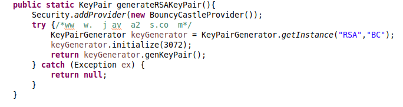

Regarding hashing algorithms, ANSSI recommends using the SHA-256 hashing algorithm. 

# The technical documentation of the user
In this part, we detail how a user can use our web application :

### User account
Fistly,An administrator or a user can create a user entity (a user of our organization). We access the userEntity form and click on the button indicated below.

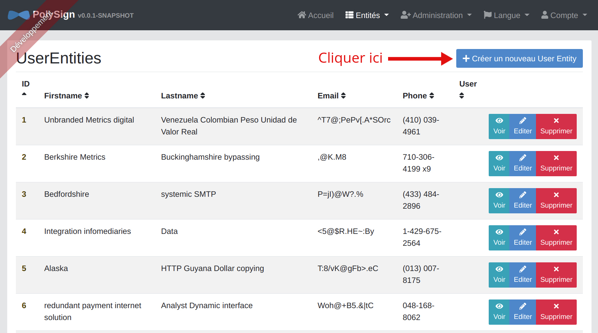

The creation form consists of two tabs, the administrator or current user fills in all informations of the new user (Name, email, ..).

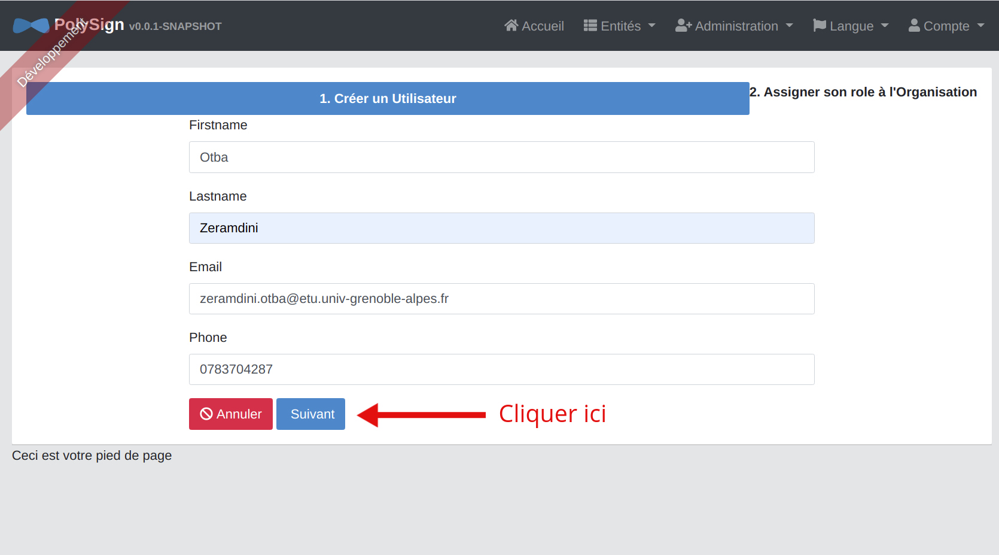

And then he clicks on the next button to assign him a role in the organization.
For example, the current user has two organizations to which he can assign a role (Polytech Grenoble and virtual digital assistant).
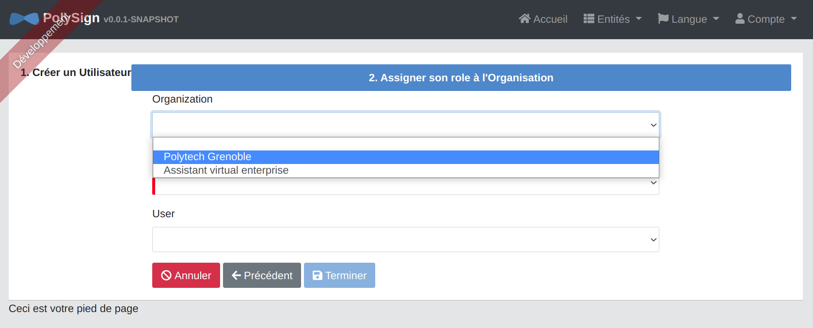

Once the "finish" button is clicked the user  account is created.
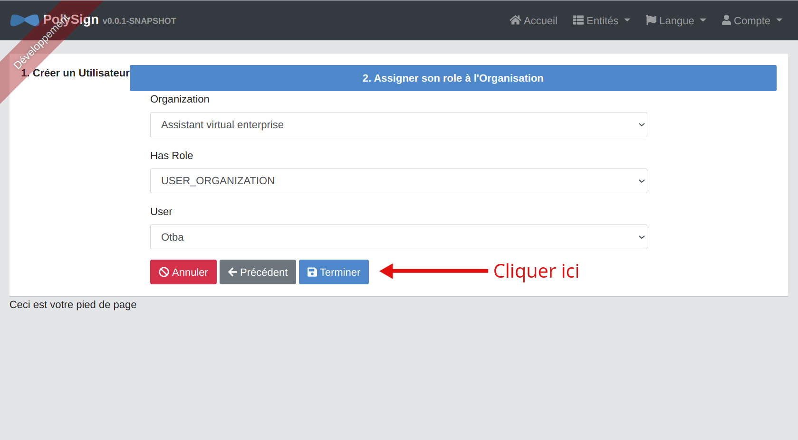
The new user receives an email with an autogenerated provisional password and a username to connect. 

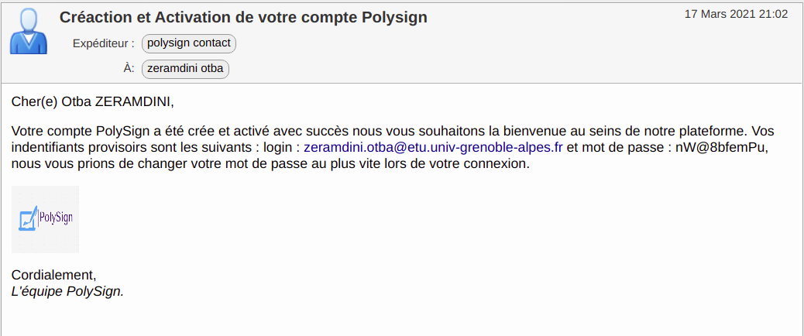
Now the user can log in by accessing the Keyklock interface

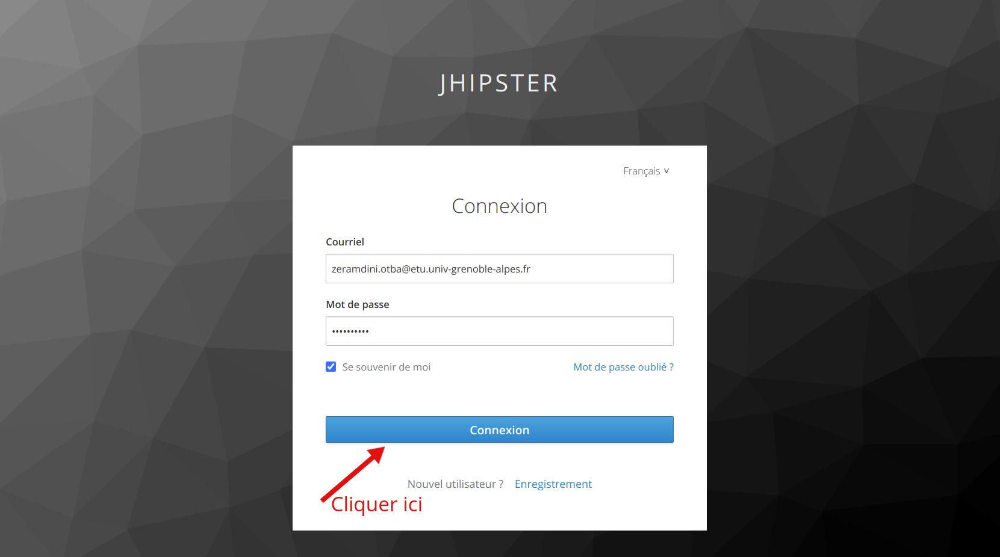
For the first connection the user must verify his email address.
it is important to remember that the user gives his details to the keyklock server and not to the jhipster application. The keyklock server is responsible here for authentication.

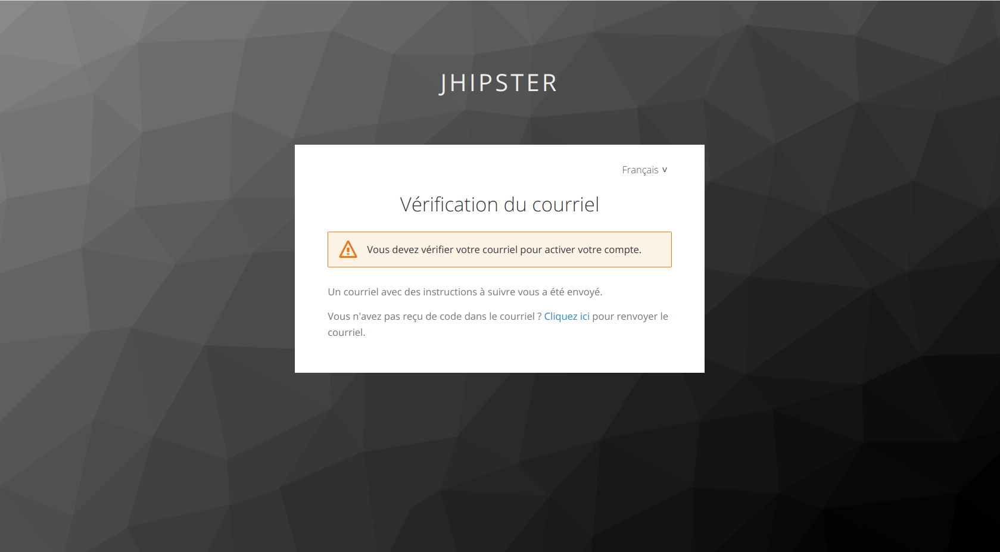

In this case, we invite him to connect as soon as possible by clicking on the link appearing on the email (lasts just 5 min !).

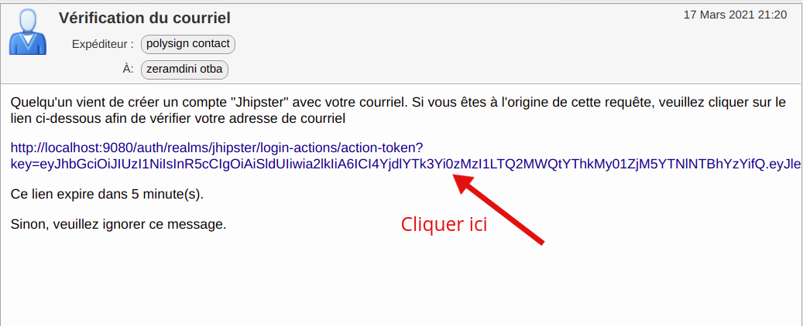
To be sure the password has not been hacked, we request a second email verification.
Now he can start by configuring OTP (One Time Password). This allows us to have Oauth 2.0 authentication (authorization protocol for double authentification).
The user must first install one of the two mobile applications: FreeOTP (Android ..) and Google auhthenticator (iPhone). He, then, scans the QRcode to make a link between the website and his phone.

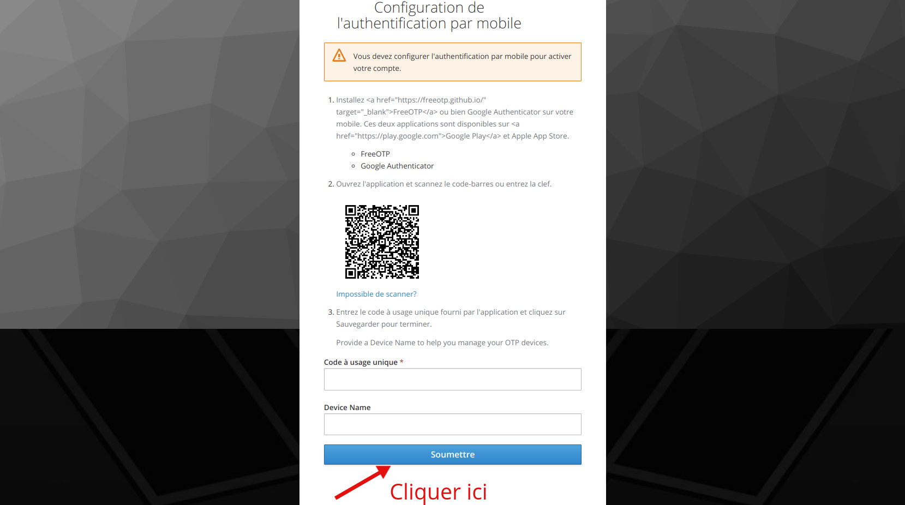
He then obtains the one-time password access, valid for 30 seconds only. This means that every 30 seconds he gets this code to be able to move on to the next step. It allows him to authenticate himself eventually.

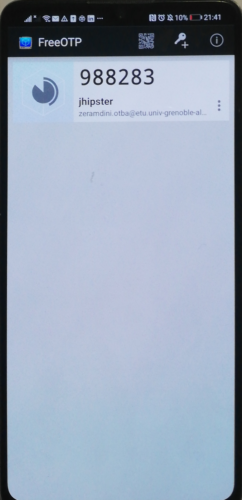

Once the OTP token is received, the user enters it in the keyklock web interface with the name of the device (optional).

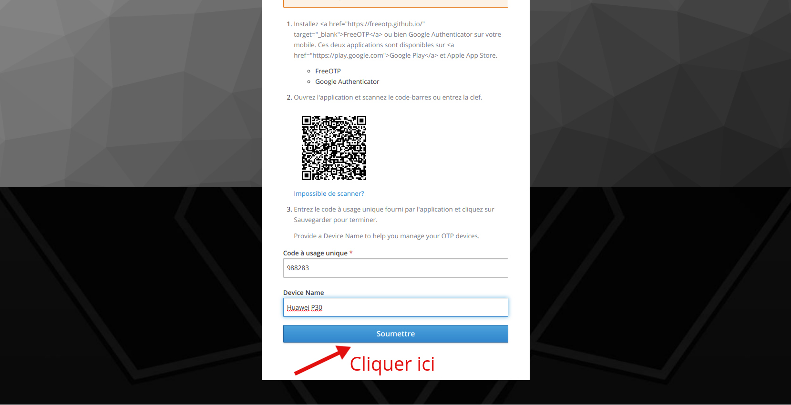

Automatically after the verification is done, we ask him to change his temporary password and confirm it.

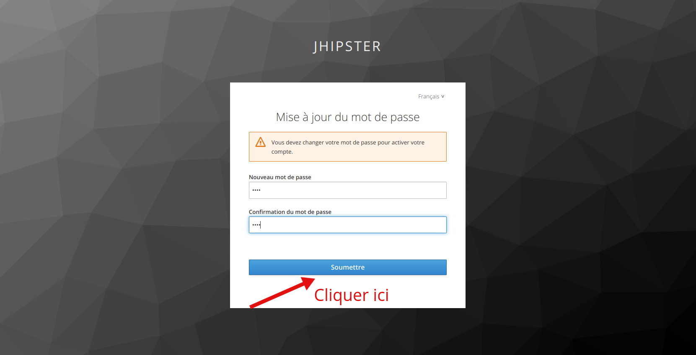

### Signature process
Now that the user can access and manage their account, they have the option of creating a process for signing a document.
To create a new signature process, all you have to do is click on the button at the top to the right  `"create a new signature process" `.

He arrives on an interface, the first tab require to choose the organization because a person can belong to several organizations (for example you can be an administrator at Polytech and a user at IAE). Besides, 

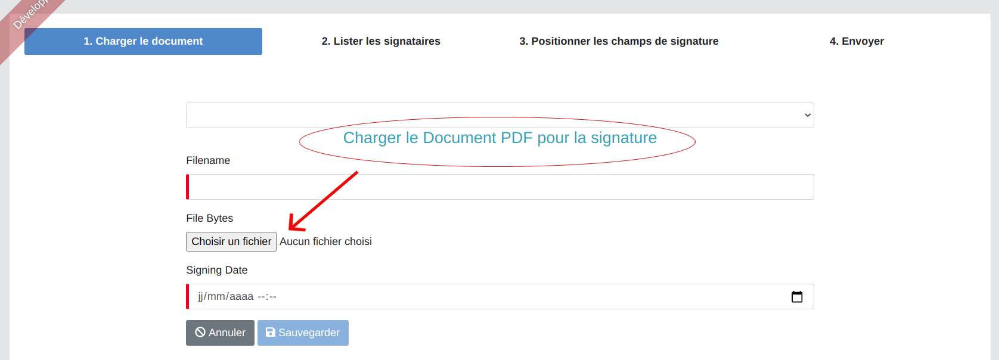
We ask him to import the file and fill in its name. We save once everything is entered.
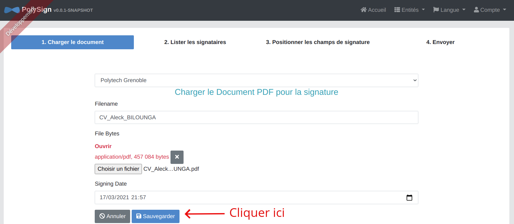

The next step is to enter signers. To add a signature, the user enters the first name, last name and email address of each signer and clicks on  `add ` button. This, will create a list of signers.

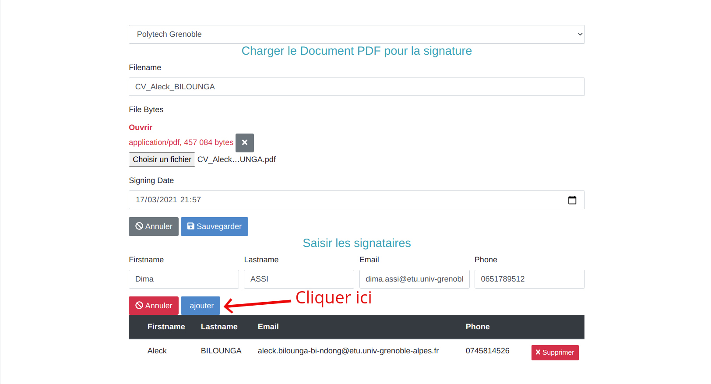

We can at any time remove or add another signer.

Therefore, the next step will be to define the signature locations on the document for each person.

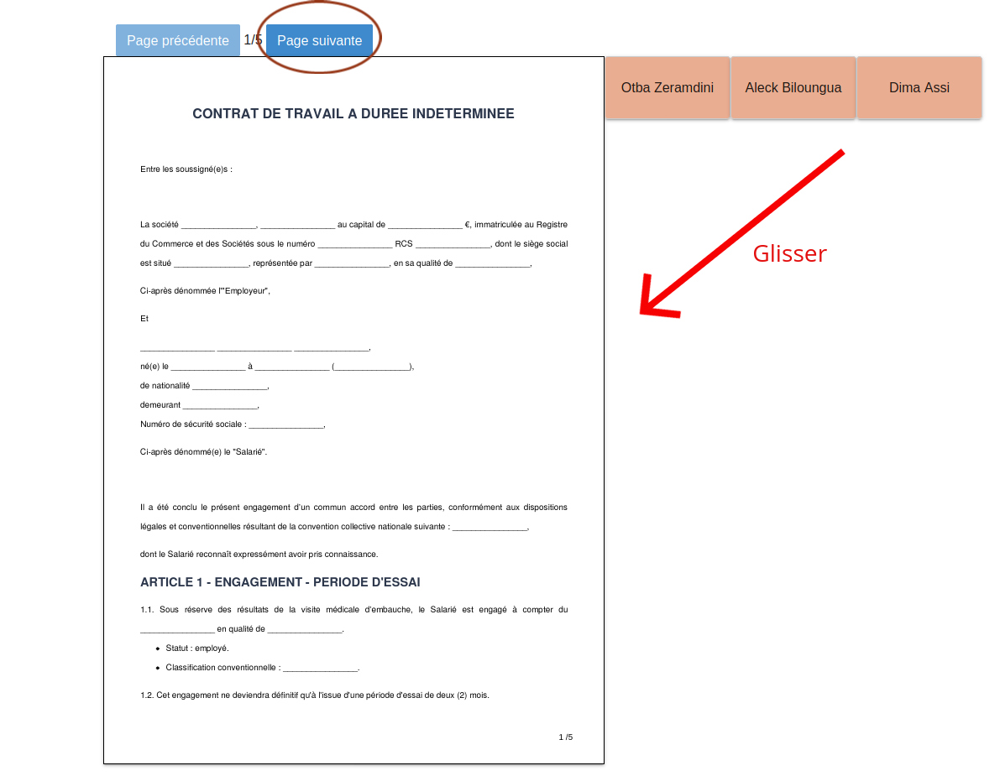
So all He have to do is to drag and drop the signature rectangles corresponding to each signer, and send the sognature request.

# Used Technologies and libraries
Mainly our application was generated using JHipster 6.10.3 ([Documentation](https://www.jhipster.tech/documentation-archive/v6.10.3)).

We choose JHipster because it reduces the initial development hurdles, simplifies and standardizes the entire programming process, whether it is for the development of the application itself or for subsequent revisions and extensions of the code. Since the main development tools are directly available to us with JHipster, the use of frameworks saves us a considerable amount of time. To generate the code we used a very useful jhipster tool: the * [JDL studio](https://start.jhipster.tech/jdl-studio/), which allowed us thanks to the UML diagram to generate the overall architecture of the application.

JHipster also allows us to generate in record time a web application that supports CRUD operations and has a clearly structured source code.

### Front-end:
* [Angular 9](https://angular.io/)
* HTML 5
* TypeScript
* CSS 3
* BOOTSTRAP

1. Used Librairies and Modules
      * ngx-extended-pdf-viewer
      * pdfjslib-dist
      * CDK Drag
2. Tried Librairies ( Not used at least)

### Back-end : 
* [Spring boot/Java](https://spring.io/projects/spring-boot)
* Spring Data/JPA
* Spring Rest API

1. Used Librairies and Modules

### Database : 
* H2 Data Base

### Authentification service
* Keycloak

### Versioning tools:
* Git, GitHub, GitHub Actions

<!--
# References
\setlength{\parindent}{-0.2in}
\setlength{\leftskip}{0.2in}
\setlength{\parskip}{8pt}
\vspace*{-0.2in}
\noindent
-->
